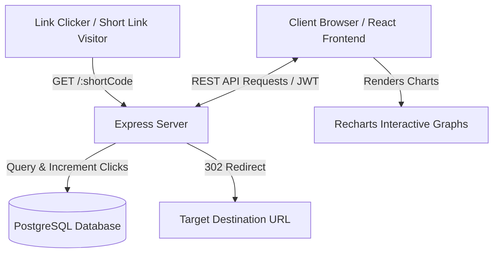

# ShortTime | Premium URL Shortener & Analytics

ShortTime is a full-stack URL shortener application built with React, Node.js (Express), and PostgreSQL. It enables users to create unique short links, set custom aliases, define self-destructing expiry times, download auto-generated QR codes, perform bulk URL shortening via CSV files, and track real-time visitor metrics (clicks, timelines, user-agent configurations, browser/OS/device details, and referrers).

---

## 🛠 Tech Stack & Architecture

- **Frontend**: React (Vite-based SPA), Lucide Icons, Recharts (for dynamic, interactive SVGs visualization charts), and Vanilla CSS (Glassmorphism layout, custom animations, custom HSL variables).
- **Backend**: Node.js, Express.js (REST APIs, Multer for memory buffered CSV parse, User-Agent parsing for analytics).
- **Database**: PostgreSQL with Sequelize ORM.
- **Session Management**: JSON Web Tokens (JWT) for secure authentication; passwords hashed securely using `bcryptjs`.

### Architecture Flow



### Database Schema

We model our data in three related relational tables:

1. **Users**: Stores registration details.
   - `id` (INTEGER, Primary Key, Auto-increment)
   - `username` (STRING, Required)
   - `email` (STRING, Unique, validated email format)
   - `password` (STRING, Hashed password block)
   - `createdAt` / `updatedAt` (TIMESTAMPS)

2. **ShortUrls**: Stores shortened links.
   - `id` (INTEGER, Primary Key, Auto-increment)
   - `originalUrl` (TEXT, Required, validated URL format)
   - `shortCode` (STRING, Unique, Indexed)
   - `alias` (STRING, Unique, Nullable)
   - `clicks` (INTEGER, Default: 0)
   - `qrCodeDataUrl` (TEXT, Holds base64 encoded QR Code data)
   - `expiresAt` (DATE, Nullable)
   - `userId` (INTEGER, Foreign Key referencing Users.id, ON DELETE CASCADE)

3. **ClickAnalytics**: Logs every redirection request.
   - `id` (INTEGER, Primary Key, Auto-increment)
   - `clickedAt` (DATE, Default: NOW)
   - `ipAddress` (STRING)
   - `browser` (STRING, parsed name and version)
   - `os` (STRING, parsed OS name)
   - `device` (STRING, Mobile / Tablet / Desktop)
   - `country` (STRING, Geolocation mock)
   - `referrer` (STRING, Domain origin name)
   - `shortUrlId` (INTEGER, Foreign Key referencing ShortUrls.id, ON DELETE CASCADE)

---

## 🚀 Setup & Execution Instructions

### Prerequisites
- Node.js (version 22+ recommended)
- PostgreSQL server (running locally on port 5432)

### 1. Database Setup
The backend is designed to **automatically create** the PostgreSQL database on boot if it does not exist, so you do not need to run manual `CREATE DATABASE` scripts.

### 2. Environment Configuration
Create/verify the `.env` file in the `/backend` directory:
```env
PORT=5001
DATABASE_URL=postgres://postgres:<YOUR_POSTGRES_PASSWORD>@localhost:5432/url_shortener
BASE_URL=http://localhost:5001
JWT_SECRET=super_secret_key_for_url_shortener_jwt_token_2026
FRONTEND_URL=http://localhost:5173
```

### 3. Dependency Installation
Run standard package installers in both directories.

**For the Backend:**
```bash
cd backend
npm install
```

**For the Frontend:**
```bash
cd frontend
npm install
```

### 4. Running the Application

**Start the Backend API Server:**
```bash
cd backend
npm run dev
```
*(Runs on [http://localhost:5001](http://localhost:5001))*

**Start the Frontend Development Server:**
```bash
cd frontend
npm run dev
```
*(Runs on [http://localhost:5173](http://localhost:5173))*

### 5. Seeding Database with Mock Data (Optional)
To immediately populate your dashboard with pre-configured analytics (graphs, visit trends, browser/device breakdowns, and click history):
```bash
cd backend
npm run seed
```
This inserts a default developer profile:
- **Email**: `admin@example.com`
- **Password**: `password123`

---

## 📝 Assumptions Made

1. **Port Configurations**: The backend port was changed to `5001` to prevent conflicts with other services running on port `5000` on the evaluation environment.
2. **Local Geolocation**: Visitors accessing local URLs on localhost (`::1` or `127.0.0.1`) are cataloged under the country label `Localhost` or `Development` since standard IP-lookup engines only map public IP ranges.
3. **CSV Headers**: For the bulk url-shortening upload tool, the CSV file is assumed to contain headers named `url` (or `originalurl`), `alias`, and `expiresAt` (or `expiry`). A template validator processes column order fallback dynamically.

---

## 📊 Sample Output & DB Entries

### 1. Database Entries

#### Sample `ShortUrls` Records:
| id | shortCode | originalUrl | clicks | userId | expiresAt |
|----|-----------|-------------|--------|--------|-----------|
| 1 | hn-news | https://news.ycombinator.com/ | 14 | 1 | NULL |
| 2 | gh-trends | https://github.com/trending | 28 | 1 | 2026-07-13 17:00:00 |
| 3 | react-docs | https://react.dev/ | 2 | 1 | 2026-06-12 17:00:00 (Expired) |

#### Sample `ClickAnalytics` Records:
| id | clickedAt | ipAddress | browser | os | device | country | referrer | shortUrlId |
|----|-----------|-----------|---------|----|--------|---------|----------|------------|
| 1 | 2026-06-13 16:45:00 | ::1 | Chrome 149 | Windows 10 | Desktop | Localhost | Direct | 2 |
| 2 | 2026-06-13 16:50:00 | 192.168.1.45 | Safari 17 | iOS 17 | Mobile | Remote Visitor | t.co | 2 |
| 3 | 2026-06-13 17:02:00 | 192.168.1.102 | Firefox 125 | macOS 14 | Desktop | Remote Visitor | reddit.com | 1 |

### 2. Server Startup Logs
```text
Database "url_shortener" already exists.
Connecting to PostgreSQL database...
PostgreSQL database synced successfully.
========================================
Server is running on port 5001
API URL: http://localhost:5001/api
Redirect base: http://localhost:5001
========================================
```

---

## 🎥 Video Demonstration Link
Please click below to watch the Loom explanation and walkthrough showing user registration, shortening with aliases/expiry, short-code redirection clicks, real-time analytics graphs, and CSV bulk shortening:
- **[Loom Video Demonstration Placeholder Link](https://www.loom.com/share/placeholder-link)**

---
This project is a part of a hackathon run by https://katomaran.com
